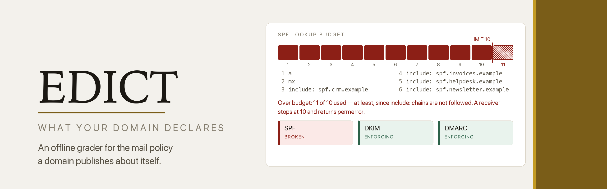
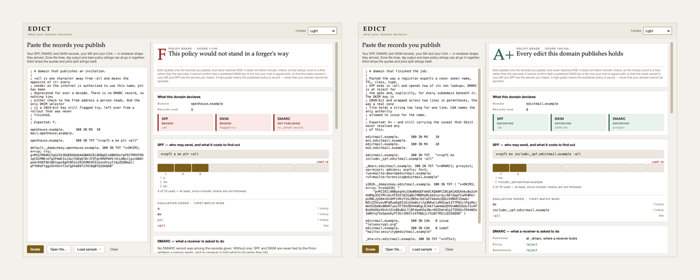

<div align="center">

<picture>
  <source media="(prefers-color-scheme: dark)" srcset="images/banner-dark.png">
  
</picture>

<br>

**What your domain declares.** An offline grader for the mail policy a domain
publishes about itself — SPF, DMARC, DKIM, MX and CAA — read straight out of
pasted DNS records. It counts the SPF lookup budget, derives a DKIM key's real
size from the key material, and grades the published policy A+ to F, without
ever resolving a name.

<br>


</div>

---

## Why

[Herald](https://github.com/at0m-b0mb/Herald) judges a message that arrived.
Edict judges the rules **you** publish about who may send as you.

SPF, DMARC, DKIM and CAA are edicts: short declarations, published in DNS, that
every receiving mail server in the world will obey on your behalf — if you say
something worth obeying. Most domains do not. They publish an SPF record that
ends in `~all`, which means *probably not, deliver it anyway*. They publish
DMARC at `p=none`, which means *tell me about the forgeries, then deliver them*.
They publish a DKIM key generated in 2014 at a size nobody has looked at since.
None of it is visible from the outside, and none of it ever complains.

Edict reads those records back to you in plain words, and grades what they add
up to. Paste what you publish — zone-file lines, `dig` output, bare policy
strings, mixed freely — and it shows you four things:

- **How far each pillar commits** — SPF, DKIM and DMARC as three chips, each
  reading `ENFORCING`, `PARTIAL`, `PERMISSIVE`, `BROKEN`, `NOT PUBLISHED` or
  `UNKNOWN`.
- **The SPF lookup budget** — ten cells, one filled per mechanism that spends a
  DNS lookup, each labelled with the mechanism that spent it, a hard red line at
  the tenth, and anything past it drawn as the refusal it is.
- **The real size of your DKIM key** — decoded out of the base64 `p=` and read
  off the RSA modulus, because it is the one thing in the record that is not
  written down.
- **Every finding**, sorted most-severe first, each with something to do about
  it.

Then it grades the whole thing, A+ to F.

<div align="center">
<picture>
  <source media="(prefers-color-scheme: dark)" srcset="images/screens-dark.png">
  
</picture>
<br>
<sub>A domain that publishes an invitation (F) beside one that finished the job (A+).</sub>
</div>

## The lookup budget

This is the part most tools do not draw, and it is the part that silently turns
a careful SPF record into no SPF record at all.

RFC 7208 allows a receiver **ten DNS lookups** to evaluate your SPF record. At
the eleventh it stops, returns `permerror`, and most receivers treat that as
though you published nothing. `include`, `a`, `mx`, `ptr`, `exists` and
`redirect` each spend one; `ip4`, `ip6` and `all` spend none. Add a provider,
and a record that worked yesterday is inert today — with no change on your side,
because the lookups they added are inside *their* record.

```
SPF LOOKUP BUDGET                                            LIMIT 10
████ ████ ████ ████ ████ ████ ████ ████ ████ ████ ┃ ░░░░
  1    2    3    4    5    6    7    8    9   10       11

Over budget: 11 of 10 used — at least, since include: chains are not
followed. A receiver stops at 10 and returns permerror.
```

**At least.** Edict never resolves anything, so it counts each `include:` as the
one lookup it can see. The record it points at may spend five more. The number
on the gauge is a **floor**, and the gauge says so every single time.

## The honest part

Edict grades the records you pasted. That is the whole of what it knows, and it
is careful about the rest:

- **It does not resolve DNS.** No sockets, no queries, no `include:` chains
  followed. The lookup count is a floor, not a total.
- **It cannot confirm a key is in use.** A 2048-bit DKIM key in your zone is
  evidence that a good key is *published* — not that your mail is signed with
  it, or signed at all.
- **It cannot check your MX or SPF hosts are yours.** It reads names; it does
  not look behind them.
- **Unknown beats a guess.** Paste no DKIM selector and the DKIM pillar reads
  `UNKNOWN`, not `absent` — Edict was not told, which is not the same as the
  key being missing. The grade is **capped at B-** and labelled as capped,
  rather than scored as though the key were gone.
- **A+ is reserved** for a policy that is complete *and* clean: one SPF record
  ending in `-all` inside budget, DMARC at `p=reject` covering subdomains with
  reports requested, a usable key of 2048 bits or better, and not one finding
  above `info`.

A high grade means **the published policy is sound** — never that your domain
cannot be spoofed. That sentence is attached to every result, in the window and
on the command line, and the words "safe" and "secure" appear nowhere as a
verdict.

Every finding is a property of the record itself — an ending that authorises
everyone, a budget a receiver cannot afford, a key too small to be worth
verifying. Edict never compares your provider against a list of who is "good",
because that list is a losing game and it teaches nothing.

## Install

```bash
git clone https://github.com/at0m-b0mb/Edict.git
cd Edict
python3 -m pip install -r requirements.txt   # just PyQt6, for the window
```

The analysis engine and the command line need **no dependencies at all** — only
the standard library. PyQt6 is required solely for the graphical grader.

## Run

**The window:**

```bash
python3 -m edict           # or:  python3 run.py
```

Paste your records, open a file, or load one of the bundled samples. Switch
between **Light**, **Dark** and **Auto** from the top-right.

**The command line** — same engine, no Qt, pipe-friendly:

```bash
edict records.dns                      # a readable report
dig +short TXT example.com | edict -   # from a pipe
edict records.dns --json               # machine-readable
python3 -m edict records.dns           # without installing
```

```
  D-  Real gaps in what this domain declares  (61/100)
  Edict grades only the records you pasted, and never resolves DNS…
  never that your domain cannot be spoofed.

  What this domain declares
    SPF    BROKEN         11 lookups — permerror
    DKIM   ENFORCING      2048-bit
    DMARC  ENFORCING      p=reject

  SPF lookup budget
    [##########|#]  Over budget: 11 of 10 used — at least, since
                    include: chains are not followed.

  Findings (10)
    [ alert ] SPF needs 11 DNS lookups — the limit is 10
    [notice ] SPF ends in ~all, not -all
    …
```

## What it reads

Paste records in whatever shape they reached you. All of these work, in one
paste, mixed together:

```
example.com.  300 IN TXT  "v=spf1 include:_spf.provider.net ~all"   zone file
"v=DMARC1; p=none; rua=mailto:dmarc@example.com"                    dig +short
v=spf1 mx -all                                                      a bare string
example.com.  300 IN MX   10 mail.example.com.                      an MX line
example.com.      IN CAA  0 issue "letsencrypt.org"                 a CAA line
sel._domainkey.example.com. IN TXT ( "v=DKIM1; k=rsa; "             wrapped
                                     "p=MIIBIjANBgkq..." )          across lines
```

Quotes come off, split TXT chunks are joined the way a resolver joins them
(`"abc" "def"` → `abcdef`), parenthesised continuations are folded, and comment
and blank lines are skipped. A line with no owner name is not an error — it is a
record whose *location* is unknown, and Edict says so instead of assuming your
DMARC record is in the right place.

## How the grade is built

Edict starts at 100 and subtracts for what it finds. Each subtraction is a
finding, written so you can act on it:

| Signal | What trips it |
|---|---|
| **SPF ending** | `+all` (anyone may send), `?all` (commits to nothing), `~all` (discourages only), or no `all` at all |
| **SPF budget** | over ten lookups (permerror), or eight to ten (one provider away from the cliff) |
| **SPF mechanisms** | `ptr` (deprecated), a range like `ip4:0.0.0.0/0`, terms stranded after `all`, malformed or unknown terms |
| **SPF records** | more than one published — a receiver then uses none of them |
| **DMARC policy** | `p=none`, `p=quarantine`, an unusable `p`, or `pct` below 100 |
| **DMARC subdomains** | `sp` weaker than `p` — the quietest gap in a deployment |
| **DMARC reporting** | no `rua`, or reports addressed to a domain that must authorise them |
| **DMARC location** | published anywhere but `_dmarc` |
| **DKIM key** | under 1024 bits, exactly 1024, revoked, unreadable, or missing entirely |
| **DKIM flags** | `t=y` — receivers are told to ignore the signature |
| **Zone** | no MX, no CAA, SHA-1-only signing |

Findings are sorted most-severe first and shown with the points they cost, so
the reasoning behind the letter is always on screen.

## Privacy

Edict never touches the network. It opens no sockets, resolves no names, and
sends nothing anywhere — the whole analysis is the standard library reading text
you already have. Records you paste in stay on your machine. The engine imports
nothing outside the standard library at all.

## Tests

```bash
python3 -m pip install -r requirements-dev.txt
python3 -m pytest -q
```

480 tests cover the record reader (including the trap where `mx`, `a` and `ptr`
name both an SPF mechanism and a DNS record type), the SPF budget arithmetic,
the DMARC tag reader, the DER walk that recovers a key's size from `p=`, the
full grading pipeline against the sample set, the command line in both output
modes, and — as the house style demands — every text/background colour pairing
against WCAG AA in both themes.

## Layout

```
edict/
  core/            the engine — pure standard library, no Qt, no network
    model.py         the dataclasses everything speaks in
    records.py       the paste  ->  normalised, classified records
    spf.py           mechanisms, qualifiers and the ten-lookup budget
    dmarc.py         tags, location, and where the reports go
    dkim.py          tags, and the DER walk that reads the key size
    grade.py         pillars, findings and the letter, with the honesty ceiling
  ui/              the window
    theme.py         the design system: one place for every token
    budget.py        the lookup-budget gauge — Edict's signature element
    widgets.py       cards, chips, key/value rows
    main_window.py   the grader itself
  cli.py           the same engine on the command line
samples/           five synthetic zones spanning A+ to F
tests/             480 tests, including the contrast suite
tools/             screenshot capture and repository art
```

## Colophon

Set in **Iowan Old Style** for identity and figures, the system **sans** for
anything you read, and a **mono** for the raw records — a serif/sans/mono mix
that reads as authored rather than assembled. The palette is warm paper and two
golds: a deep brass legible as small text, and a brighter shine used only on
marks that carry no words. Dark mode is true black, with nothing in the ramp
that reads as blue. Every colour is declared as a light/dark pair, and a test
suite holds every pairing to WCAG AA so the theme can never quietly regress.

The social card and banner are not illustrations of the gauge: `tools/gen_banner.py`
imports the engine, grades `samples/over-budget.dns`, and draws the cells, the
labels and the caveat sentence the tool itself produced.

## License

MIT — see [LICENSE](LICENSE). For authorised, educational, and personal use:
Edict is a reader, not a resolver.
